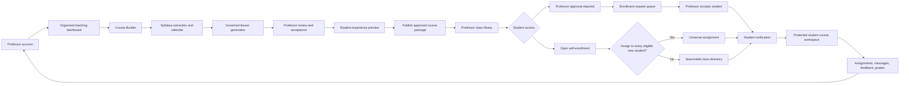
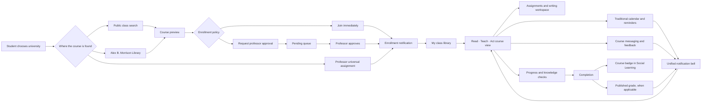
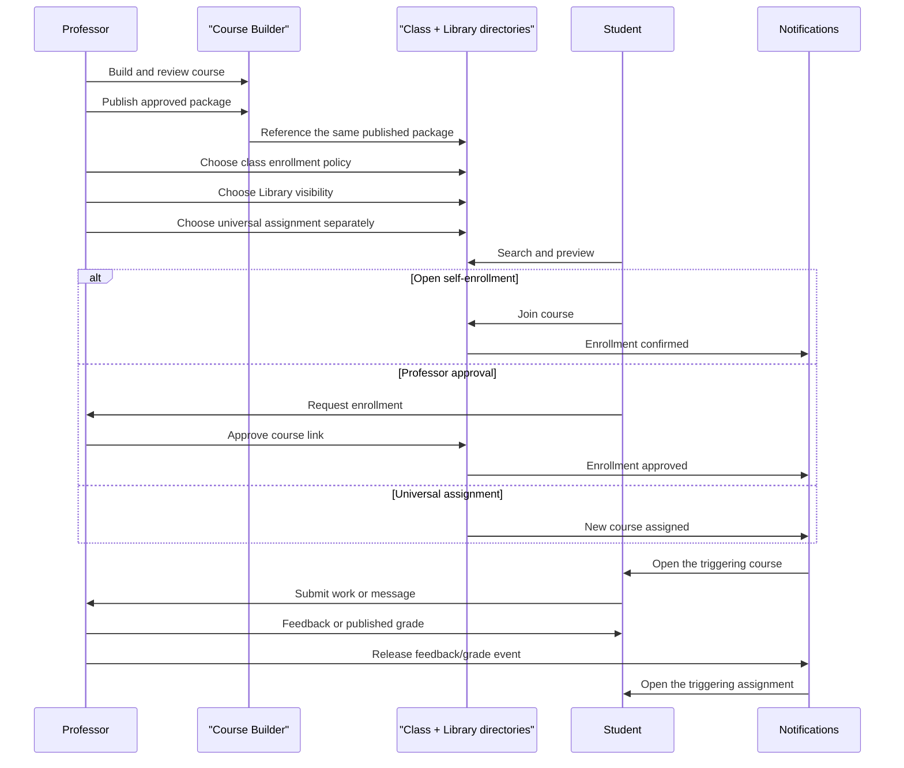
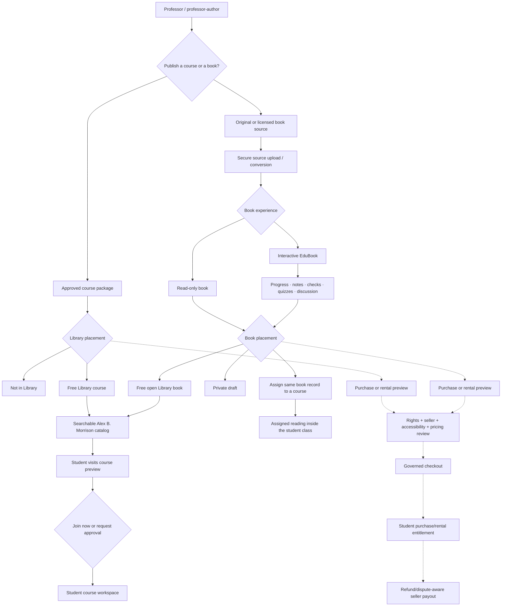

# Professor, student, and Alex B. Morrison workflows

These maps describe the governed EdNotebook experience after the Phase 5
course, enrollment, calendar, notification, writing, and publishing units.
Solid paths are usable product paths. The dashed commerce path remains a
controlled preview until seller, tax, refund, dispute, checkout, and payout
controls are approved.

## 1. Professor teaching workflow

## 2. Student experience workflow

## 3. Combined professor-to-student lifecycle

## 4. Professor to Alex B. Morrison Library/Bookstore

### Product rules shown in the maps

- Course publishing, Library listing, enrollment approval, and universal
  assignment are separate controls.
- A course listing references its already-approved course package.
- A linked or assigned book keeps one publication source record.
- Free courses and open books can be searchable and visitable now.
- Assigned books require access to the linked course.
- A read-only book keeps the familiar book experience; an interactive EduBook
  can add progress, private annotations, knowledge checks, quizzes, and
  discussion layers.
- Commercial prices may be prepared for review, but the client cannot grant
  paid access. Checkout and seller payout remain behind the commerce gate.
