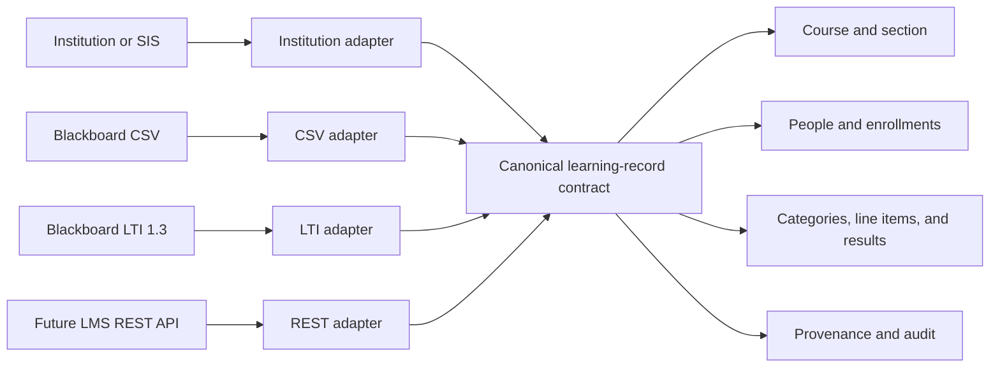

# EdNotebook learning-system data model

## Why this exists

Blackboard CSV, LTI 1.3, LTI Advantage, a future Blackboard REST connector, and an institution's SIS should not create competing versions of a course, learner, assignment, or grade. EdNotebook uses one canonical learning-record contract and treats each connection as an adapter.

The field set follows familiar education-system concepts from [1EdTech OneRoster 1.2](https://standards.1edtech.org/oneroster/specifications/standards/v1p2), [LTI 1.3](https://www.imsglobal.org/spec/lti/v1p3/), and [LTI Assignment and Grade Services 2.0](https://www.imsglobal.org/spec/lti-ags/v2p0/). This is a readiness model, not a claim that EdNotebook is currently 1EdTech certified.

Provider-specific fields remain at the adapter edge. The internal UUIDs and grade rules remain stable when the institution changes LMS products or enables a more automated integration later.

## Record families

### Institution and connection

| Familiar field | Canonical meaning | Example source | Privacy/storage |
| --- | --- | --- | --- |
| Institution ID and name | EdNotebook tenant/organization | Institution onboarding | Authenticated database record |
| LMS provider and hostname | Connected learning platform | Blackboard registration | Institution-scoped configuration |
| Issuer | LTI platform identifier | LTI `iss` | Institution-scoped configuration |
| Client ID | Tool registration identifier | Blackboard LTI registration | Institution-scoped configuration |
| Deployment ID | Stable deployment identifier | LTI deployment claim | Institution-scoped configuration |
| OIDC login, authorization, token, and JWKS URLs | Verified service endpoints | Institution/LMS registration | Server configuration; allowlisted HTTPS only |
| Approved services and scopes | NRPS, AGS, Deep Linking capabilities | LTI launch/service claims | Least-privilege connection policy |
| Connection status | setup, testing, active, suspended, retired | EdNotebook administrator | Never mark active without a successful institutional test |
| Signing keys and client secrets | Server authentication material | EdNotebook and LMS | Secret manager/server environment only; never browser, GitHub, or audit payload |

The manual CSV workflow does not need a client ID, deployment ID, token, or secret. Those fields stay null until an institution registers LTI or a REST connector.

### Course, section, and academic session

| Familiar field | Canonical field | Typical sources |
| --- | --- | --- |
| EdNotebook course ID | `ednotebookCourseId` | EdNotebook |
| Institution ID | `institutionId` | EdNotebook/institution |
| LMS context ID | `externalContextId` | LTI context or LMS API |
| SIS course ID | `externalCourseId` | OneRoster/SIS |
| SIS class or section ID | `externalSectionId` | OneRoster/SIS |
| Course code | `courseCode` | EdNotebook, LTI context label, SIS |
| Section code | `sectionCode` | SIS or LMS |
| Course title | `title` | EdNotebook, LTI context title, SIS |
| Subject | `subject` | EdNotebook/SIS |
| Term/session ID and label | `academicSessionId`, `academicSessionLabel` | SIS/OneRoster; EdNotebook teaching window |
| Start and end | `startAt`, `endAt` | SIS/OneRoster/LMS |
| Status | `status` | active, draft, archived, or provider equivalent |

An EdNotebook course represents the teachable delivery context. External course and section identifiers are mappings; they never replace the EdNotebook UUID. A provider/deployment/context tuple must map to at most one EdNotebook course unless an institution administrator explicitly changes that binding.

### Person and enrollment

| Familiar field | Canonical field | Notes |
| --- | --- | --- |
| EdNotebook user ID | `ednotebookUserId` | Internal UUID; never sent as a Blackboard CSV identifier |
| LTI user subject | identifier `lti_subject` | Stable only within the LTI issuer/registration context |
| OneRoster sourced ID | identifier `oneroster_sourced_id` | SIS/roster identifier |
| LMS user ID | identifier `lms_user_id` | Provider-scoped identifier |
| SIS user ID | identifier `sis_user_id` | Institution/SIS identifier |
| Student/institution ID | identifier `student_id` or `institution_user_id` | May be sensitive and institution-defined |
| Username | identifier `username` | Provider login name; not assumed globally unique |
| Name and email | `givenName`, `familyName`, `displayName`, `email` | Optional display/matching fields, not the permanent LTI key |
| Course role | `role` | administrator, instructor, teaching assistant, learner, observer, or content developer |
| Enrollment status | `status` | active, inactive, pending, or provider equivalent |
| Primary enrollment | `isPrimary` | Supports multiple roles/sections without guessing |
| Enrollment dates | `beginAt`, `endAt` | Optional institutional roster dates |

CSV matching may propose a unique exact email, but a professor must review weaker name matches. LTI uses the signed platform subject and deployment context as the external identity; it does not use email as the durable key. Raw identifiers are institution/course scoped and protected by RLS.

### Grade category and line item

| Familiar field | Canonical field | EdNotebook source |
| --- | --- | --- |
| Gradebook category ID/title | `externalCategoryId`, `categoryTitle` | `grade_categories` plus external mapping |
| Category weight | `weightPercent` | `grade_categories.weight_percent` |
| EdNotebook grade item ID | `ednotebookGradeItemId` | `grade_items.id` |
| LMS line item/column ID | `externalLineItemId` | Blackboard column ID, AGS line item URL/ID, or REST ID |
| LTI resource link ID | `externalResourceLinkId` | LTI resource link claim |
| Title and description | `title`, `description` | Assignment/grade item |
| Points possible | `scoreMaximum` | `grade_items.max_points` |
| Availability/open date | `startAt` | Provider or assignment setting |
| Due date | `dueAt` | `grade_items.due_at` |
| Close date | `endAt` | Provider or assignment setting |
| Grade release date | `releaseAt` | Provider or publication setting |
| Grade item status | `status` | draft, published, closed, archived, or provider equivalent |
| Provider tag | `tag` | Optional AGS/provider grouping value |

The tuple of course, learner, and line item identifies a gradebook cell. A title may help a professor match columns, but an available external line-item ID is the durable provider reference.

### Grade result

| Familiar field | Canonical field | Rules |
| --- | --- | --- |
| Learner | internal and external user IDs | Must belong to the selected course/context |
| Grade item | internal and external line-item IDs | Must belong to the selected course/context |
| Score earned | `scoreGiven` | Numeric; no silent coercion |
| Points possible | `scoreMaximum` | Positive numeric maximum |
| EdNotebook status | `status` | pending, missing, finalized, released, exempt, or voided |
| Learner activity | `activityProgress` | LTI values such as `Initialized`, `Started`, `InProgress`, `Submitted`, `Completed` |
| Grading state | `gradingProgress` | LTI values such as `NotReady`, `Pending`, `PendingManual`, `FullyGraded`, `Failed` |
| Attempt | `attemptNumber` | Nullable when the source does not provide attempts |
| Comment/feedback | `comment` | Optional and never logged |
| Submitted, graded, released | `submittedAt`, `gradedAt`, `releasedAt` | ISO timestamps when provided |
| Source and version | `provenance` | provider, mode, source ID, received time, payload hash, contract version |

Only finalized EdNotebook grades enter the manual Blackboard CSV. LTI AGS passback will use the same result record, including `scoreGiven`, `scoreMaximum`, `activityProgress`, and `gradingProgress`. Provider adapters translate from the canonical record; they do not invent a second grading status model.

## Source of truth and precedence

- EdNotebook remains authoritative for EdNotebook course content, memberships created in EdNotebook, grade items created in EdNotebook, and finalized EdNotebook grades.
- The institution/SIS is authoritative for official institutional identifiers and roster data when a roster connection is approved.
- The LMS is authoritative for its context IDs, deployment IDs, resource links, line-item IDs, and import/service responses.
- A confirmed mapping links records; it does not merge or overwrite the source systems' identifiers.
- Conflicts are surfaced for review. Email, display name, or assignment title alone never silently changes a durable mapping.
- Every exchange records provider, integration mode, source record, timestamp, and hash or version where available.

## Data minimization

The model reserves interoperable fields without requiring every integration to collect them.

- **Manual CSV:** reads only the uploaded template and selected finalized grades; keeps the raw file in browser memory; stores confirmed identifiers, mappings, hashes, counts, and audit metadata.
- **LTI launch:** requires signed issuer, audience, deployment, nonce/state, message, role, and resource/context claims; name and email remain optional and are stored only when needed by institutional policy.
- **NRPS roster:** should request roster data only for the launched context and only after the institution approves the scope.
- **AGS grades:** sends the minimum learner, line-item, score, progress, and timestamp fields needed for passback.
- **SIS/OneRoster:** remains optional. Demographic fields outside the roster/course/grade purpose are not part of this contract.
- Raw tokens, signing keys, passwords, full JWTs, CSV contents, and student-grade payloads are never written to browser storage, source control, URLs, or application logs.

## Implementation contract

The runtime definitions live in `src/integrations/learningRecordContract.js`. Each adapter must:

1. Normalize provider input to the canonical course, person, enrollment, grade-item, and result records.
2. Validate course ownership, enrollment, line-item ownership, numeric ranges, finalization, and stale versions on the server.
3. Keep provider-only claims or headers out of the core course and grade tables unless a reviewed mapping exists.
4. Store credentials only in server-side secret storage.
5. Use the shared identifiers and grade statuses in UI labels, audit metadata, reconciliation, CSV export, LTI services, and future REST jobs.
6. Add a contract migration and compatibility test before changing a canonical field.

Nullable fields mean “not supplied by this integration,” not “safe to infer.” This permits a small CSV pilot now without redesigning course and grade records when LTI, Blackboard REST, or an SIS is approved later.
