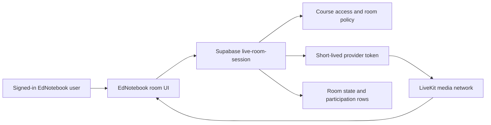

# Live office hours architecture

Status: LiveKit Cloud selected; account secrets and deployment still require owner activation.

## Product decision

EdNotebook office hours are browser-based, audio-first rooms with a participant list and screen sharing. There is no webcam control and the client explicitly disables the camera after connecting. Recording is off by default.

The selected provider is LiveKit Cloud behind an EdNotebook session endpoint. LiveKit exposes the same core APIs for its managed cloud and open-source self-hosted server, so the UI and EdNotebook authorization model can remain stable if hosting ever changes. There is no remaining provider-selection step. LiveKit documents automatic reconnection across network changes and UDP, TURN, TCP, and TURN/TLS connection fallbacks. Sources: [LiveKit overview](https://docs.livekit.io/intro/about/), [connection reliability](https://docs.livekit.io/intro/basics/connect/), and [self-hosting comparison](https://docs.livekit.io/transport/self-hosting/).

## Implemented boundary

- `live_rooms` stores class scope, room state, provider name, permissions, capacity, and recording state—not media.
- `live-room-session` authenticates the EdNotebook user, relies on course access, checks room capacity, and issues a short-lived LiveKit token.
- Token grants allow microphone publishing. Screen sharing is allowed for the host and optionally for study-room members. Camera is absent from the permitted sources.
- `LiveLearningRooms` attaches remote audio and screen tracks, renders participants and speaking state, reconnects through the provider SDK, and always provides an EdNotebook leave action.
- Office hours are available from the educator dashboard. Study rooms reuse the same system from the student dashboard.

## Trust boundaries

The browser never receives the LiveKit secret. A room identifier alone is not authorization. Provider webhook events should update usage and ended-room state only after signature verification.

## Recording

Recording is not part of the initial release path. The schema supports `off`, `host_opt_in`, and `everyone_opt_in`, but the UI currently creates rooms with `off`. Before recording is enabled, add:

1. A visible pre-join choice for every participant.
2. A persistent recording indicator in the room.
3. A server check that all active participants have recorded a decision when policy is `everyone_opt_in`.
4. Private file storage, retention selection, deletion, and access logs.
5. Provider egress webhook verification and failure handling.

LiveKit currently lists recording/export as a separate transcode service and advertises end-to-end encryption for media. E2EE and server-side recording have an inherent product tradeoff because the recorder must be able to decode the selected tracks. Sources: [LiveKit pricing and recording](https://livekit.com/pricing) and [encryption overview](https://docs.livekit.io/transport/encryption/).

## Cost guardrails

As of July 19, 2026, LiveKit's Build plan lists 5,000 included WebRTC participant-minutes and 100 concurrent connections. The Ship plan begins at $50/month, includes 150,000 WebRTC minutes, and then lists $0.0005/minute. Recording/transcoding is separately metered. Prices can change, so the billing dashboard remains the source of truth. Source: [LiveKit pricing](https://livekit.com/pricing).

Required controls before broad release:

- Per-account and per-class monthly room-minute quotas.
- Default room capacity of 25 and maximum of 100.
- Warning at 80% of a quota and fail closed at 100% unless an owner raises it.
- Automatic room end after inactivity and a hard maximum session duration.
- Daily usage aggregation from signed provider webhooks.
- A provider kill switch that disables new tokens without affecting the rest of EdNotebook.

## Browser acceptance gate

Validate current Chrome, Edge, Firefox, and Safari on macOS plus Safari on a physical iPhone/iPad. The pass requires microphone permission, screen-share permission where the browser supports it, reconnect after Wi-Fi/cellular change, audio-device change, background/foreground recovery, and a clear failure message. Self-hosting later also requires TLS, TURN, and firewall testing; LiveKit's VM guide calls out TCP, UDP, TURN, and a wide UDP media range. Source: [LiveKit VM deployment](https://docs.livekit.io/transport/self-hosting/vm/).

## Owner activation

Add Supabase function secrets `LIVEKIT_URL`, `LIVEKIT_API_KEY`, and `LIVEKIT_API_SECRET`; deploy the migration and `live-room-session`; create a signed LiveKit webhook endpoint; set a provider budget alert; then run the browser acceptance gate above.
